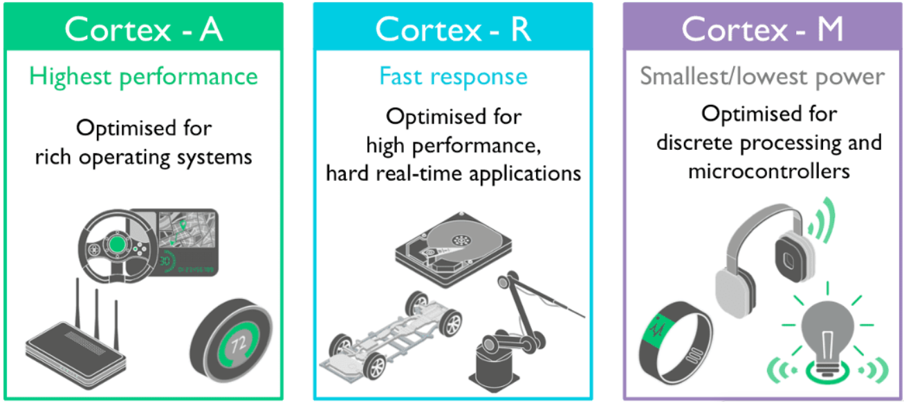

# Curso STM32

Minhas anotações e atividades do treinamento do professor Gabriel Moreira Vigiano sobre os microcontroladores da família [STM32 32-bit ARM Cortex MCUs](https://www.st.com/en/microcontrollers-microprocessors/stm32-32-bit-arm-cortex-mcus.html).

Este repositório contém exercícios, códigos de exemplo, documentação e recursos sobre o curso. Utilize os links abaixo para acessar rapidamente os conteúdos.

---

## Documentação e Ferramentas

- **Fabricante**: [STMicroelectronics](https://www.st.com/content/st_com/en.html)
- **IDE**: [STM32CubeIDE](https://www.st.com/en/development-tools/stm32cubeide.html)
- **Gravador**: [STM32CubeProg](https://www.st.com/en/development-tools/stm32cubeprog.html)

- **HALs disponibilizado pela ST**: [Resultados encontrados](https://www.st.com/content/st_com/en/search.html#q=hardware%20abstraction%20layer%20-t=resources-page=1)

---

## Módulos

### 1. [Microcontroladores e Processadores ARM](#1-microcontroladores-e-processadores-arm)

A família do Cortex tem três categorias principais:
1. ARM Cortex-A (p/ processadores)
2. ARM Cortex-R (p/ aplicações em tempo real)
3. ARM Cortex-M (p/ microcontroladores)

- [8-bit vs. 32-bit MCU: Choosing the Right Microcontroller for Your PCB Design](https://resources.altium.com/p/8-bit-vs-32-bit-mcu-choosing-right-microcontroller-your-pcb-design)

Alguns conceitos:
- **Firmware** -  um tipo de software que é armazenado em um dispositivo eletrônico e que controla o funcionamento deste dispositivo.
- **Linguagens de programação para MCU's** - C, C++, Assembly, Python, Java Basic e Pascal.
- **Bare Metal** - programação de um sistema operacional instalado diretamente no hardware, sem camadas de software de gestão e hipervisores.
- **HAL (Hardware Adstraction Layer) e LL (Low-Layer) APIs** - O HAL é uma camada de software que permite a comunicação entre o software e o hardware, e o Low-Layer APIs são mais detalhadas e específicas do que as High-Level APIs, permitindo um controle mais granular.

### 2. [Softwares e Recursos](#2-softwares-e-recursos)

### 3. [Revisão de Linguagem C Básica](#3-revisão-de-linguagem-c-básica)

### 4. [Ambientes, Projetos e Depurador SWD](#4-ambientes-projetos-e-depurador-swd)

### 5. [Clocks do STM32](#5-clocks-do-stm32)

### 6. [Gpio's do STM32](#6-gpios-do-stm32)

### 7. [Timers do STM32](#7-timers-do-stm32)

### 8. [OC, IC e PWM, DeadTime e Frequência Variável](#8-oc-ic-e-pwm-deadtime-e-frequência-variável)

### 9. [ADC (Conversor Analógico Digital)](#9-adc-conversor-analógico-digital)

### 10. [DAC (Conversor Digital Analógico)](#10-dac-conversor-digital-analógico)

### 11. [WDT - Watchdog com STM32](#11-wdt---watchdog-com-stm32)

### 12. [Modos de Baixo Consumo (Low Power Modes)](#12-modos-de-baixo-consumo-low-power-modes)

### 13. [RTC (Real Time Clock Interno do STM32)](#13-rtc-real-time-clock-interno-do-stm32)

### 14. [Comunicação Serial - USART](#14-comunicação-serial---usart)

### 15. [Comunicação I2C](#15-comunicação-i2c)

### 16. [Comunicação SPI](#16-comunicação-spi)

### 17. [FreeRTOS](#17-freertos)

### 18. [LCD 16x2](#18-lcd-16x2)

### 19. [SdCard](#19-sdcard)

### 20. [TouchGF Designer](#20-touchgf-designer)

### 21. [Nextion Display](#21-nextion-display)

### 22. [Modbus - RTU Serial e Ethernet](#22-modbus---rtu-serial-e-ethernet)

### 23. [Processamento Digital de Sinais](#23-processamento-digital-de-sinais)

### 24. [Comunicação CAN](#24-comunicação-can)

### 25. [CMSIS-DSP](#25-cmsis-dsp)

### 26. [Memória Flash Interna do STM32](#26-memória-flash-interna-do-stm32)

### 27. [Bootloader - Sistema de Memória](#27-bootloader---sistema-de-memória)

---

