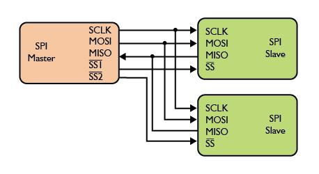

# Curso STM32

Minhas anotações e atividades do treinamento do professor Gabriel Moreira Vigiano sobre os microcontroladores da família [STM32 32-bit ARM Cortex MCUs](https://www.st.com/en/microcontrollers-microprocessors/stm32-32-bit-arm-cortex-mcus.html).

Este repositório contém exercícios, códigos de exemplo, documentação e recursos sobre o curso. Utilize os links abaixo para acessar rapidamente os conteúdos.

---

## Documentação e Ferramentas

- **Fabricante**: [STMicroelectronics](https://www.st.com/content/st_com/en.html)
- [STM32 MPU wiki](https://wiki.st.com/stm32mpu)
- [STM32 MCU wiki](https://wiki.st.com/stm32mcu)
- [HALs disponibilizado pela ST](https://www.st.com/content/st_com/en/search.html#q=hardware%20abstraction%20layer%20-t=resources-page=1)

- [STM32Cube github](https://github.com/STMicroelectronics)
- [STM32CubeIDE resource portal on wiki](https://wiki.st.com/stm32mcu/index.php?title=STM32CubeIDE:Introduction_to_STM32CubeIDE&sfr=stm32mcu)
---

## Módulos

### 1. [Microcontroladores e Processadores ARM](#1-microcontroladores-e-processadores-arm)

A família do Cortex tem três categorias principais:
1. ARM Cortex-A (p/ processadores)
2. ARM Cortex-R (p/ aplicações em tempo real)
3. ARM Cortex-M (p/ microcontroladores)

- [8-bit vs. 32-bit MCU: Choosing the Right Microcontroller for Your PCB Design](https://resources.altium.com/p/8-bit-vs-32-bit-mcu-choosing-right-microcontroller-your-pcb-design)

Alguns conceitos:
- **Firmware** -  um tipo de software que é armazenado em um dispositivo eletrônico e que controla o funcionamento deste dispositivo.
- **Linguagens de programação para MCU's** - C, C++, Assembly, Python, Java Basic e Pascal.
- **Bare Metal** - programação de um sistema operacional instalado diretamente no hardware, sem camadas de software de gestão e hipervisores.
- **HAL (Hardware Adstraction Layer) e LL (Low-Layer) APIs** - O HAL é uma camada de software que permite a comunicação entre o software e o hardware, e o Low-Layer APIs são mais detalhadas e específicas do que as High-Level APIs, permitindo um controle mais granular.

### 2. [Softwares e Recursos](#2-softwares-e-recursos)
- **IDE**: [STM32CubeIDE](https://www.st.com/en/development-tools/stm32cubeide.html)
- **Gravador**: [STM32CubeProg](https://www.st.com/en/development-tools/stm32cubeprog.html)
- **Servidor ST-LINK**: [ST-LINK server](https://www.st.com/en/development-tools/st-link-server.html)
- **Núcleo Board**: 
    - [NUCLEO-L476RG](https://www.st.com/en/evaluation-tools/nucleo-l476rg.html): 
        - [MB1136-C05 Board schematic](https://www.st.com/resource/en/schematic_pack/mb1136-default-c05_schematic.pdf)
        - [Datasheet - STM32L476RG](https://www.st.com/resource/en/datasheet/stm32l476je.pdf)
        - [Reference manual (RM0351)](https://www.st.com/resource/en/reference_manual/rm0351-stm32l47xxx-stm32l48xxx-stm32l49xxx-and-stm32l4axxx-advanced-armbased-32bit-mcus-stmicroelectronics.pdf)

    - [NUCLEO-G474RE](https://www.st.com/en/evaluation-tools/nucleo-g474re.html#documentation): 
        - [MB1367-G474RE-C05 Board schematic](https://www.st.com/resource/en/schematic_pack/mb1367-g474re-c05_schematic.pdf)
        - [Datasheet - STM32G474RE](https://www.st.com/en/microcontrollers-microprocessors/stm32g474re.html)
        - [Reference manual (RM0440)](https://www.st.com/resource/en/reference_manual/rm0440-stm32g4-series-advanced-armbased-32bit-mcus-stmicroelectronics.pdf)

- **Upgrade St-Link**: 

### 3. [Revisão de Linguagem C Básica](#3-revisão-de-linguagem-c-básica)

- Pratique em [Dev-C++](https://sourceforge.net/projects/orwelldevcpp/).

- [Documentação C++](https://cplusplus.com/)

- [Tabelas de valores e unidades em C](https://www.each.usp.br/digiampietri/ACH2023/tabelasemc.html)

- [Tabela ASCII](https://www.ibm.com/docs/pt-br/aix/7.3?topic=adapters-ascii-decimal-hexadecimal-octal-binary-conversion-table)

- [Calculadora de Conversão de Bases Numéricas](https://www.calculadoraonline.com.br/conversao-bases)

- [Guia da linguagem C - Embarcados](https://embarcados.com.br/linguagem-c-guia-completo/)  

### 4. [Ambientes, Projetos e Depurador SWD](#4-ambientes-projetos-e-depurador-swd)

- Board Selector: [NUCLEO-L476RG](https://www.st.com/en/evaluation-tools/nucleo-l476rg.html#overview)

- Compilar: *Project>Build All*
- Debugger: *Run>Debug As>1 STM32 Cortex-M C/C++ Application*

    Click em *Apply* e *OK* na janela de configuração do debugger.
    

-  Debugger Serial:   
    

    Em *Run>Debug Configurations*, habilite em *Debugger* o recurso *Serial Wire Viewr (SWV)*. 
    
    

    Ao entrar do modo *Debugger* vai em *Window>Show View> SWV>SWV Data Trace Timerline Graph*

    Click em *Configure trace* e na aba inicializada deixe as seguinte opções:
    

### 5. [Gravação, Bootloader e Customização](#5-gravação-bootloader-e-customização)
- Modelos de ST-Links: [ST-LINK/V2](https://www.st.com/en/development-tools/st-link-v2.html) e [STLINK-V3](https://www.st.com/en/development-tools/stlink-v3set.html)

- Habilitando a geração dos arquivos Bin e Hex ao compilar: 
    
    Va em "*Project>Properties>C/C++ Build>Settings*", e deixe marcado as seguinte opções:
    

- [STM32 M4 Clicker](https://www.mikroe.com/clicker-stm32f4)    

- STM32 microcontroller system memory boot mode: [AN2606](https://www.st.com/content/ccc/resource/technical/document/application_note/b9/9b/16/3a/12/1e/40/0c/CD00167594.pdf/files/CD00167594.pdf/jcr:content/translations/en.CD00167594.pdf)

- Para gravação do firmware via UART, use o [FLASHER-STM32](https://www.st.com/en/development-tools/flasher-stm32.html) ou o [STM32CubeProg](https://www.st.com/en/development-tools/stm32cubeprog.html), e faça uma das conexão indicadas na tabela 152 do ***application note* AN2606**. 

    NOTA: Coloque o **BOOT0** em nível logico alto para gravação do firmware. 

- Cuidados com o ***Option Bytes***: [AN4758](https://www.st.com/resource/en/application_note/an4758-proprietary-code-readout-protection-on-stm32l4-stm32l4-stm32g4-and-stm32wb-series-mcus-stmicroelectronics.pdf) e [AN4701](https://www.st.com/resource/en/application_note/an4701-proprietary-code-readout-protection-on-microcontrollers-of-the-stm32f4-series-stmicroelectronics.pdf)

- Bootloader Customizado
    - Referencias: [AN3155](https://www.st.com/resource/en/application_note/an3155-usart-protocol-used-in-the-stm32-bootloader-stmicroelectronics.pdf) e AN2606.
    - Terminal RS232: [Termite](https://www.compuphase.com/software_termite.htm)
    - O *baud rate* deve está entre 1200 e 115200, e a paridade em *even*.

    

    USART bootloader commands: 

### 6. [Clocks do STM32](#6-clocks-do-stm32)
- Documentação: [AN2867](https://www.st.com/resource/en/application_note/an2867-guidelines-for-oscillator-design-on-stm8afals-and-stm32-mcusmpus-stmicroelectronics.pdf)

- Configurado em ***System Core>RCC***: 

    

- Ociladores - Crytal X3
    - Valores de *load capacitance*:

        **NOTA**: A capacitância de dispersão $C_S$ pode se estimado como $2pF$ ou $5pF$, o $C_L$ é fornecido pelo fabricante do crytal selecionado, e $C_{L1}$ e $C_{L2}$ são os valores dos capacitores C33 e C34.

        
- Ociladores - Crytal Externo
    - Pinos para conexão externa: 
    
        **NOTA**: Recomendado utilizar crytal de $16MHz$ ou $8MHz$ para projetos com HSE.

### 7. [Gpio's do STM32](#7-gpios-do-stm32)
- Documentação: [AN4899](https://www.st.com/resource/en/application_note/an4899-stm32-microcontroller-gpio-hardware-settings-and-lowpower-consumption-stmicroelectronics.pdf)

- **NOTA**: Na seção ***"Output driving current"*** do datasheet,  encontram-se as informações sobre a corrente máxima que os pinos de GPIO podem suportar, seja ao receber (sink) da carga conectada, ou ao fornecer (source) para ela. 

- Opções de configura:
    - GPIO mode: 

- **Debounce** é uma técnica que evita que um interruptor físico seja detectado múltiplas vezes quando pressionado ou liberado. 
    - **NOTA**: Ao utilizar um botão, use um capacito ($1uF$) em paralelo ao mesmo.

- **Interrupção** é uma funcionalidade que interrompe a tarefa atual do processador para processar um evento.

### 8. [Timers do STM32](#8-timers-do-stm32)

### 9. [OC, IC e PWM, DeadTime e Frequência Variável](#9-oc-ic-e-pwm-deadtime-e-frequência-variável)

### 10. [ADC (Conversor Analógico Digital)](#10-adc-conversor-analógico-digital)

- **Conversão Simples**
    - **Resolução**: Capacidade de representar um sinal analógico em um valor digital com precisão.
        
        | **Resolução (bits)** | **Range**       | **Precisão**                          |
        |----------------------|------------------|----------------------------------------|
        | n                    | $2^n - 1$        | $\frac{V_{ref}}{2^n - 1}$              |
        | 8                    | $2^8 - 1$        | $\frac{V_{ref}}{2^{8} - 1}$            |
        | 16                   | $2^{16} - 1$     | $\frac{V_{ref}}{2^{16} - 1}$           |
        | 32                   | $2^{32} - 1$     | $\frac{V_{ref}}{2^{32} - 1}$           |
        | 64                   | $2^{64} - 1$     | $\frac{V_{ref}}{2^{64} - 1}$           |

    - **Frequência de Amostragem**: Quantidade de vezes que um sinal analógico é medido ou amostrado em um determinado intervalo de tempo para ser convertido em um sinal digital.

- **Conversão com Interrupção**
    
    Em `` NVIC Settings > NVIC Interrupt Table ``, habilite a opção: ``ADC1, ADC2 and ADC3  global interrrupts``.
    
- **Conversão com DMA**

    Em `` Parameter Settings ``, habilite a opção: ``DMS Continuos Requests``. Em seguinda adicione e configure o DMA o associando a um periférico. 

    
    - **DMA - Visão Geral**
        
        O ***Direct Memory Access*** é um elemento lógico digital que permite a transferência de dados que pode ser usado em conjunto com o processador principal do mesmo chip. Uma de suas vantagens é que libera operações da CPU e a torna "livre". Outra característica é a otimização de transferência de dados aumentando a eficiência e velocidade no sistema.
        
        

        - **Modelos de Transferência de Dados:**
            1. Mover dados de um periférico para um endereço de memória;
            2. Mover dados de um endereço de memória para um periférico;
            3. Mover dados de memória para memória. 
    - **Frequência de Amostragem**
        - Em `` Clock Configuration`` observe a frequência do clock nos periféricos. Na NUCLEO-L476RG, a frequencia maxima é 80Hz, e o clock dos canais do ADC está conectado ao barramento do AHB2.  
        

        - Ao configura o ADC, em ``Parameter Settings``>``ADC_Settings``> ``Clock Prescale`` pode-se dividir o valor do ckock configurado na arvore de clocks para se obter novas opção. O $f_{ADC}$ será o resultado da divisão do o ckock pelo prescale. 

        - Seguindo nas configuração,  em ``Parameter Settings``>``Rank``> ``Sampling Time`` ($t_s$) temos indicado quantos ciclos o microcontrolador precisa para fazer a amostragem.

        - Em ``NVIC Settings``, habilite a interrupção do ADC para que quando o microcontrolador termine a conversão, a interrupção seja disparada.

        -  No datashet do microcontrolador, verifique a tabela de características do ADC. No [NUCLEO-L476RG](https://www.st.com/resource/en/datasheet/stm32l476je.pdf), o $t_{CONV}$ indica o tempo entre uma amostra e outra, sendo calculado da seguinte forma:
        
            

            Logo, a frequência de amostragem é: $f_s = \frac{1}{t_{CONV}}$.
    - **ADC Simultâneo**
        - No *application note* [AN3116](https://www.st.com/resource/en/application_note/an3116-stm32s-adc-modes-and-their-applications-stmicroelectronics.pdf), temos a documentação dos modos e aplicações do ADC do STM32.

        - A entrada regular simultânea é usada para se obter a performance de dois canais simultaneamente com a sincronização do ADC1 e ACD2. 

            

        - As leituras do ADC1 e ADC2 fica armazenado no registrador ADC1 no formado de 32 bits. 

        - Habilite o ``IN1 Single-ended`` do ADC1 (Master) e o ``IN16 Single-ended`` do ADC2 (Slave). Nas configurações do master, em ``ADC_Common_Settings``>``Mode``, selecione a opção ``Dual regular simultaneous mode only``.  
    - **Auto Caibração**:
        - No *application note* [AN2834](https://www.st.com/resource/en/application_note/cd00211314-how-to-optimize-the-adc-accuracy-in-the-stm32-mcus-stmicroelectronics.pdf), temos a documentação de como otimizar a precisão do ADC nos MCUs STM32.

        - A função de calibração é a ``HAL_ADCx_Calibration_Start()``, e há um pré-requisito para usa-lá: No momento da calibração o ADC precisa está desabilitado, logo a função so pode ser chamada antes do ``HAL_ADC_Start()`` ou depois do  ``HAL_ADC_Stop()``.

### 11. [DAC (Conversor Digital Analógico)](#11-dac-conversor-digital-analógico)

### 12. [WDT - Watchdog com STM32](#12-wdt---watchdog-com-stm32)

### 13. [Modos de Baixo Consumo (Low Power Modes)](#13-modos-de-baixo-consumo-low-power-modes)

### 14. [RTC (Real Time Clock Interno do STM32)](#14-rtc-real-time-clock-interno-do-stm32)

### 15. [Comunicação Serial - USART](#15-comunicação-serial---usart)

- **Conexão**

    

- **Modos de Transmissão** 

    
Artigo: [USART vs UART: Entendendo Diferenças e Aplicações](https://basicaodaeletronica.com.br/microcontroladores/usart-vs-uart-entendendo-diferencas-e-aplicacoes/)

- **Padrões de Comunicação Serial:**
    - **TTL (*Transistor-Transistor Logic*)** opera com tensões mais baixas (geralmente 0-3.3V ou 0-5V), sendo mais comum em sistemas embarcados e microcontroladores. 
    - **RS-232** opera com tensões mais elevadas (geralmente +/- 15V), tornando-o mais resistente a ruído e adequado para comunicações em maior distância, como na comunicação entre computadores e periféricos.
    
        

- **Software Auxiliares**
    - [Virtual Serial Ports Emulator (VSPE)](https://eterlogic.com/Products.VSPE.html)  
    - [Termite Serial](https://www.compuphase.com/software_termite.htm)
    - [PulseView](https://sigrok.org/wiki/PulseView)
    - [Logic 2](https://www.saleae.com/pages/downloads)

### 16. [Comunicação I2C](#16-comunicação-i2c)

### 17. [Comunicação SPI](#17-comunicação-spi)
- ***Serial Peripheral Interface* (SPI)**:
    - Alta velocidade (20MHz)
    - Conexões e Pinos:
    

    - **Modos de Operação**: consistem em quatro combinações de *Clock Polarity*(CPOL) e *Clock Phase* (CPHA).

        | Modo | CPOL | CPHA | Borda de Troca | Transição | Nível em IDLE |
        |:-: | :-: | :-: |:-----:| :--------: | :----: |
        | 0  | 0   | 0   | Subida | Meio do bit | 1 |
        | 1  | 0   | 1   | Decida | Começo do bit | 0 |
        | 2  | 1   | 0   | Decida | Meio do bit | 0 |
        | 3  | 1   | 1   | Subida | Começo do bit |1 |

        **NOTA**: Os modos 0 e 3 são os mais utilizados.

        

        **NOTA**: O CPOL define o nível inicial do clock, sendo 0 para nível baixo e 1 para nível alto, enquanto o CPHA determina o momento da transição, sendo 0 para a transição no meio do bit, e 1 para a transição no início do bit.

    - Informações Complementares:

        [Artigo: Hardware - Interface SPI by Leonardo Ritter](https://www.hardwarecentral.net/single-post/2018/08/29/hardware-interface-spi) 

        
        
        

- Componente que usam comunicação SPI: [MCP4921](https://ww1.microchip.com/downloads/en/DeviceDoc/21897B.pdf), [MCP3008](https://ww1.microchip.com/downloads/aemDocuments/documents/MSLD/ProductDocuments/DataSheets/MCP3004-MCP3008-Data-Sheet-DS20001295.pdf), [ADE9000](https://www.analog.com/en/products/ade9000.html).

### 18. [FreeRTOS](#18-freertos)
É um tipo de sistema operacional destinado a execução de tarefas dentro de um determinado prazo de tempo (deadline). O principal propósito de [FreeRTOS](https://www.freertos.org/) é a execução de mais tarefas (tasks) sincronizadas.
    

- **Treinamento da STMicroelectronics**:
    - [FreeRTOS on STM32 v2](https://www.st.com/content/st_com/en/support/learning/stm32-education/stm32-moocs/freertos-common-microcontroller-software-interface-standard-osv2.html)
    - [MOOC - FreeRTOS on STM32 v2](https://youtube.com/playlist?list=PLnMKNibPkDnExrAsDpjjF1PsvtoAIBquX&si=L7-Rqo6C5gulsUDn)
    - [Materiais (slides, projetos, etc.)](https://drive.google.com/drive/folders/1yALzIl_zjftUID3aAWHSE3cJWfmixsSO)

- **Características**:
    - Gratuito (MIT Open Source License);
    - Código Aberto;
    - Integração no STM32CubeIDE, CMSIS-RTOS (Cortex Microcontroller Software Interface Standard)

- **Em que dispositivos é usado?**
    - MCUS de 8/16 bits -> Programação em Bare Matel;
    - **MCUS de 32 bits** --> Programação em Bare Matel ou **FreeRTOS**;
    - Processadores -> Sistema Operacional de Próposito Genérico (Windows, Linux, Android e etc).

- **Configurando**

    Verifique se a opção ``USE_PREEMPTION`` está habilitada e observe o valor do deadline em ``TICK_RATE_HZ``.

    Após selecionar o modo, vá na aba ``Tasks and Queues`` do menu de configurações para criar, excluir ou editar as tarefas.
    

    **NOTA:** Ao usar o RTOS, é recomendado **NÃO** usar o ``Systick`` como o timebase source.    
    

- **Prioridades**
    
    

- **Gerenciamento de Funções**:``osThreadSuspend()`` e ``osThreadResume()``.

- **Sincronização de tarefas**:
    - **Semáforo Binário:** É um mecanismo de sincronização simples, que pode ter apenas dois estados: "0" (fechado) e "1" (aberto). Ele é utilizado para garantir que apenas uma tarefa tenha acesso a um recurso compartilhado por vez, funcionando como um "trava" de acesso. Quando o semáforo está em "1", a tarefa pode acessar o recurso. Quando está em "0", a tarefa que tentar acessar o recurso será bloqueada até que o semáforo seja liberado.

    - **Semáforo Contador:** É uma versão mais generalizada do semáforo binário. Ele pode ter um valor que varia de 0 até um valor máximo especificado. O semáforo contador é útil quando você precisa controlar o acesso a múltiplos recursos idênticos (por exemplo, várias instâncias de um mesmo tipo de recurso). Cada vez que uma tarefa solicita um recurso, o semáforo é decrementado; quando o recurso é liberado, o semáforo é incrementado. Quando o semáforo chega a 0, outras tarefas ficam bloqueadas até que um recurso se torne disponível.

    - **Mutex:** É um tipo especial de semáforo projetado especificamente para evitar condições de corrida entre tarefas que tentam acessar recursos compartilhados. Ao contrário de um semáforo binário, o mutex é associado a uma única tarefa, e só a mesma tarefa pode liberar o mutex que ela adquiriu. Isso garante que uma tarefa tenha a posse exclusiva do recurso, evitando que outra tarefa altere o estado do recurso enquanto ele estiver sendo utilizado. O mutex é frequentemente usado para proteger seções críticas de código.

    - **Queues:** É uma estrutura de dados utilizadas para a troca de informações entre tarefas em um RTOS, operando no modelo FIFO (First-In, First-Out). As filas permitem que uma tarefa coloque dados na fila e outra tarefa os processe na ordem em que foram inseridos. Elas são frequentemente usadas para sincronização de tarefas, permitindo que tarefas produtoras e consumidoras troquem dados de forma eficiente. Além disso, as filas podem ser utilizadas para controlar o fluxo de informações, bloqueando tarefas quando a fila está cheia ou vazia.

### 19. [LCD 16x2](#19-lcd-16x2)

### 20. [SdCard](#20-sdcard)

### 21. [TouchGF Designer](#21-touchgf-designer)

### 22. [Nextion Display](#22-nextion-display)

### 23. [Modbus - RTU Serial e Ethernet](#23-modbus---rtu-serial-e-ethernet)

O [MODBUS](https://www.modbus.org/) é um protocolo de comunicação desenvolvido pela Modicon em 1979, cujo o principal propósito é estabelecer a comunicação de dados entre dispositivos, sendo altamente encontrado em equipamentos de automação e controladores lógicos programáveis.

- **Camada física** :
    - **RS232-Serial**: utilizado apenas em comunicações do tipo ponto a ponto (o mestre e 1 escravo), com velocidade máxima em torno de 115Kbps e a distância máxima entre os dispositivos em torno de 30m. 
    - **RS485-Serial**: muito utilizado na indústria e permite taxas de 12Mbps e em alguns casos até 50Mbps, com a distância máxima em torno de 1200m, com o máximo 32 dispositivos no barramento.
    - **Ethernet TCP/IP (Modbus TCP)**.

- **Topologia**:
    - **Modbus Serial:**
    

    - **Modbus TCP:**
        
        
- **Modos de transmisão**:

    Os modos definem a forma como são transmitidos os bytes da mensagem, e como a informação da mensagem será empacotada na mensagem e descompactada. Não é possível utilizar os dois modos de transmissão na mesma rede. Na especificação do protocolo Modbus estão definidos os seguintes modos de transmissão:

    - **ASCII**

        

    - **RTU (Remote Terminal Unit)**:     
        

    - **TCP**

        

### 24. [Processamento Digital de Sinais](#24-processamento-digital-de-sinais)

### 25. [Comunicação CAN](#25-comunicação-can)

A comunicação CAN (*Controller Area Network*) foi desenvolvica em 1980 por Robert Bosch na Alemanha originalmente para industria automotiva.

- **Características:**
    - Protocolo altamente utilizado na industria e também em sistemas automotivos;
    - Comunicação serial multi-mestre desenvolvida para alta velocidade, imunidade a ruídos e características de detecção de erros;
    - A velocidade de comunicação de até 1Mbits/s;
    - Retransmissão automática de mensagens de erro;
    - Endereçamento é por mensagem e não ao nó;
    - [ISO 11898](https://www.iso.org/obp/ui/en/#iso:std:iso:11898:-1:ed-3:v1:en);

Todos os dispositivos podem ouvir a mensagem, mas somente vão receber o que é definido.
A rede CAN se baseia em um barramento de dois fios (**CAN High** e **CAN Low**) por onde as mensagens são transmitidas. As mensagens são transmitidas em **quadros de bits**, que são organizados em campos com diferentes funções, incluindo a prioridade da mensagem. 

O CAN utiliza um sistema de **priorização baseado em IDs** (identificadores) de mensagem, onde mensagens com IDs mais altos têm maior prioridade e acesso ao barramento. Cada **unidade de controle** (ECU) na rede monitora o barramento para verificar se existem mensagens para ela, e as processa de acordo com a prioridade. 

- **Link de dados CAN e subcamadas físicas em relação ao modelo OSI**:

    

- **Sinais do protocolo CAN**

    A rede CAN utiliza **sinais diferenciais** com um par de fios (CAN_H e CAN_L), para transmitir dados, e a diferença de potencial entre estes dois fios é o que carrega a informação.

    - **Sinal Diferencial**: utiliza dois sinais complementares para transportar informações. 
        - Maior imunidade a ruídos, pois o ruído que afeta um sinal também afetará o outro, e a diferença entre eles permanecerá. 
        - Podem ser mais sensíveis a problemas de impedância se os comprimentos das linhas não forem bem combinados.
    
    - **Single Ended (terminação única)**: utiliza um sinal em relação a um ponto de referência (ground).
        - Mais simples e econômicos de implementar, pois requerem menos fios e componentes.
        - São mais sensíveis a ruídos, pois o ruído pode afetar o sinal diretamente. 
        - Podem exigir uma tensão de alimentação mais alta para transmitir o sinal.

        

    - **Estados das Sinais**:

        

    - **Resolução de Colisões**: 
    
        Quando ocorre uma colisão, os dispositivos envolvidos interrompem a transmissão e passam para um estado de “escuta”, enquanto um processo de arbitragem é iniciado. 
        
        Durante de arbitragem, os dispositivos competem pela prioridade de transmissão com base nos seus identificadores.
        
        - O dispositivo com o identificador mais alto tem a prioridade mais alta e pode transmitir seus dados primeiro.
        - O dispositivo que detectou a colisão primeiro tem prioridade para tentar transmitir novamente.

        Se dois dispositivos tiverem o mesmo identificador, uma estratégia de “*bit stuffing*” é utilizada para diferenciar as mensagens. O bit stuffing consiste na inserção de bits adicionais no campo de dados da mensagem para evitar que dois dispositivos transmitam a mesma sequência de bits.
    
    - **Tipos de Frame e Formato das Mensagens**: 
        - **Frame Remoto**
        - **Frame de Erro**
        - **Frame de Sobre Carga**   
        - **Frame de Dados**: 
            - ***Standar*** (2.0A - 11 bits de identificação): só comunica com o mesmo tipo.
            - ***Extended*** (2.0B - 29 bits de identificação), também é compatível com o *Standar*.

            
            
            - **Visão geral**: 

                

                - **Start of Frame (SOF)**: Indica o início da transmissão de um quadro com um bit **dominante (0)**.
                
                -  ***Stuff bit***: Separa uma sequencia de 5 zeros consecutivos.

                - **Remote Transmission Request (RTR)**: Usado para diferenciar entre um quadro de dados e um quadro remoto (solicitação de dados).
                    - **RTR dominante (0)** indica um **quadro de dados**
                    - **RTR recessivo (1)** indica um **quadro remoto**

                - **Código de Comprimento de Dados (DLC)**: Campo de **4 bits** que indica o número de bytes de dados (0 a 8 bytes) que estão presentes na carga útil da mensagem.  

                - **Acknowledgement (ACK)**: Indica ao transmissor se a mensagem foi recebida corretamente por pelo menos um receptor. Possui **dois bits**, um para espaçamento e outro para o registro. 
                    - Inicialmente recessivo (1) transmitido pelo transmissor.
                    - Se um receptor receber a mensagem sem erros, ele sobrescreve este bit com um valor **dominante (0)** 

                -  **End Of Frame (EOF)**: Consiste em **7 bits** que marcam o **fim de uma mensagem**. A presença destes **7 bits recessivos (1) consecutivos** informa que a mensagem está concluída.

                - **Inter-Frame Space (IFS)**: Campo de **3 bits ou mais**, dependendo da versão do CAN. Em ambos os casos, ele é sempre composto por bits **recessivos (1)**, que indicam o **estado ocioso** do barramento.

    - **Configurando Velocidade de Transmissão**:
    Em `Parameter Settings` de `CAN1 Mode and Configuration`, temos as configurações de `Bit Timings Parameters`. 
    
        

        - **Cálculo dos Tempos de Bit**: 
            
            Uma ferramenta útil para calcular os tempos de bit corretamente é o sit [CAN Bit Time Calculation](http://www.bittiming.can-wiki.info). Basta selecionar o dispositivo (`ST Microelectronics bxCAN`) e informar a frequência do clock do periférico (verificar em `Clock Configuration` do CubeMX).

        - **Estrutura de um Bit CAN (conforme norma ISO-11898)**:

            

        - **Definições dos Parâmetros**: 

            - `Prescaler (for Time Quantum)`: Define por quanto o clock do periférico CAN será dividido para obter o **Time Quantum (Tq)**.  

            - `Time Quantum (Tq)` : Unidade básica de tempo no protocolo CAN. Determina a resolução da temporização dos bits.  
                - Fórmula: $T_q = \frac{1}{f_{CAN}}$,
            onde $( f_{CAN} = \frac{f_{clock}}{\text{Prescaler}} )$.

                > **Nota**: No [STM32L476RG](https://www.st.com/en/microcontrollers-microprocessors/stm32l476rg.html), o canal CAN fica no barramento `APB1` e a frequência maxima suportada é 80 MHz.

            - `Time Quantum in Bit Segment 1`: Quantidade de Tq usada na primeira parte do bit, que inclui:  
                - PROP_SEG (tempo de propagação)  
                - PHASE_SEG1 (ajuste de sincronização)  
            
                - **Fórmula:**  Bit Segment 1 = PROP_SEG + PHASE_SEG1

            - `Time Quantum in Bit Segment 2` : Quantidade de Tq na segunda parte do bit, usada para compensar erros de fase. Corresponde ao valor PHASE_SEG2.

            - `Baud Rate`: Taxa de transmissão de bits por segundo (bps) no barramento CAN.  

    - **Filtro CAN**:
        - **Configuração**:
            - `FilterBank`- Especifica o banco de filtros que será inicializado. A quantidade disponíveis pode ser cerificada no manual de referencia do microcontrolador. 
            - `FilterMode` - Especifica o modo do filtro a ser inicializado.
            - `FilterScale`- Especifica a escala do filtro (32 ou 16 bits).
            - `FilterIdHigh` - Especifica o número de identificação do filtro (MSBs para uma configuração de 32 bits, o primeiro para uma configuração de 16 bits).
            - `FilterIdLow`- Especifica o número de identificação do filtro (LSBs para uma configuração de 32 bits, o segundo para uma configuração de 16 bits).
            - `FilterMaskIdHigh`- Especifica o número da máscara de filtro ou o número de identificação, de acordo com o modo (MSBs para uma configuração de 32 bits, o primeiro para uma configuração de 16 bits).
            - `FilterMaskIdLow`- Especifica o número da máscara de filtro ou o número de identificação, de acordo com o modo (LSBs para uma configuração de 32 bits, o segundo para uma configuração de 16 bits).
            - `FilterFIFOAssignment` - Especifica o FIFO (0 ou 1U) que será atribuído ao filtro.
            - `FilterActivation` - Habilita ou Desabilita o filtro.
            - `SlaveStartFilterBank`- Selecione o banco de filtros inicial para a instância CAN escrava. Para uma única instancia do CAN, esse parâmetro não tem significado.

        - **Exemplo de implementação**:
        ~~~c
        CAN_FilterTypeDef  sFilterConfig;

        // Configure the CAN Filter 
        
        sFilterConfig.FilterBank = 0;
        sFilterConfig.FilterMode = CAN_FILTERMODE_IDMASK;
        sFilterConfig.FilterScale = CAN_FILTERSCALE_32BIT;
        sFilterConfig.FilterIdHigh = 0x0000;
        sFilterConfig.FilterIdLow = 0x0000;
        sFilterConfig.FilterMaskIdHigh = 0x0000;
        sFilterConfig.FilterMaskIdLow = 0x0000;
        sFilterConfig.FilterFIFOAssignment = CAN_RX_FIFO0;
        sFilterConfig.FilterActivation = ENABLE;
        sFilterConfig.SlaveStartFilterBank = 14;

        if(HAL_CAN_ConfigFilter(&hcan1, &sFilterConfig) != HAL_OK)
            {
            /* Filter configuration Error */
            Error_Handler();
            }
        ~~~

    Manuais de referencia: [STM32L47 (RM0351)](https://www.st.com/resource/en/reference_manual/rm0351-stm32l47xxx-stm32l48xxx-stm32l49xxx-and-stm32l4axxx-advanced-armbased-32bit-mcus-stmicroelectronics.pdf), 

### 26. [CMSIS-DSP](#26-cmsis-dsp)

### 27. [Memória Flash Interna do STM32](#27-memória-flash-interna-do-stm32)

### 28. [Bootloader - Sistema de Memória](#28-bootloader---sistema-de-memória)

---

